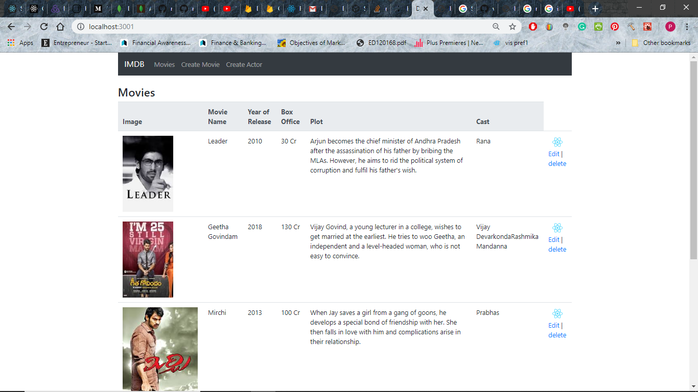
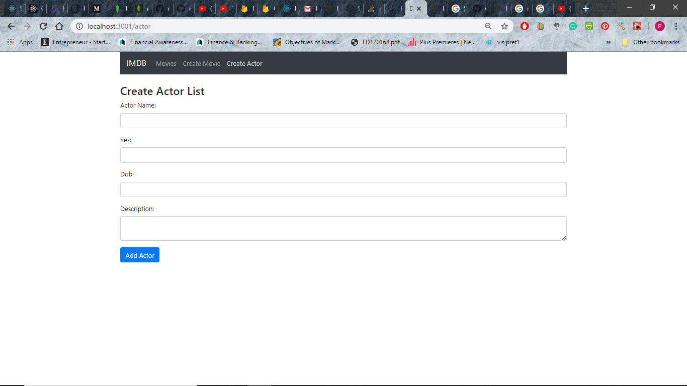
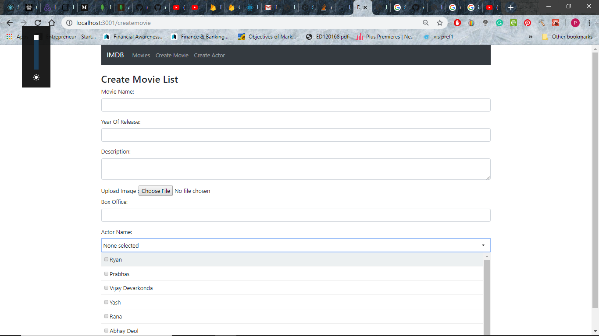
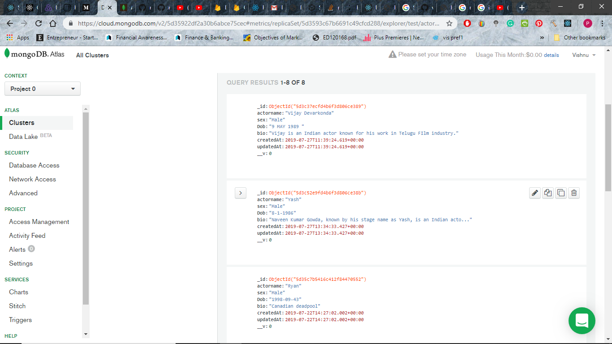
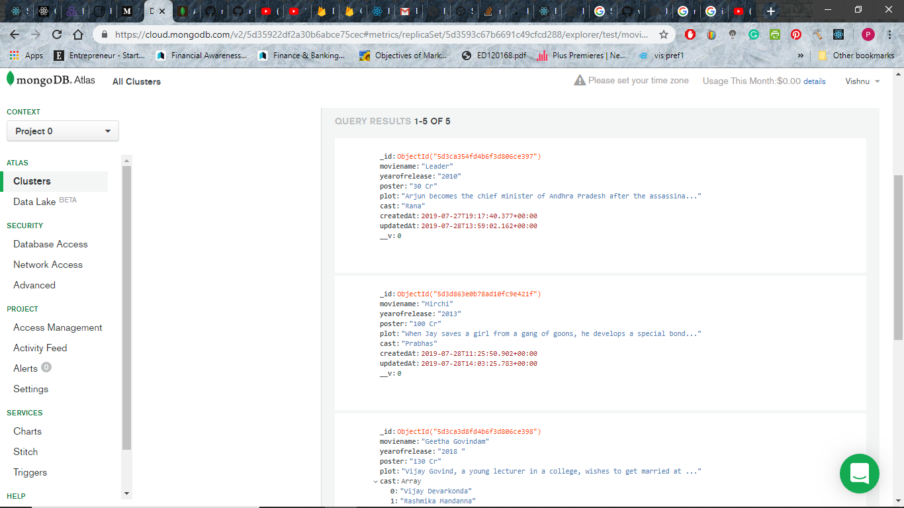
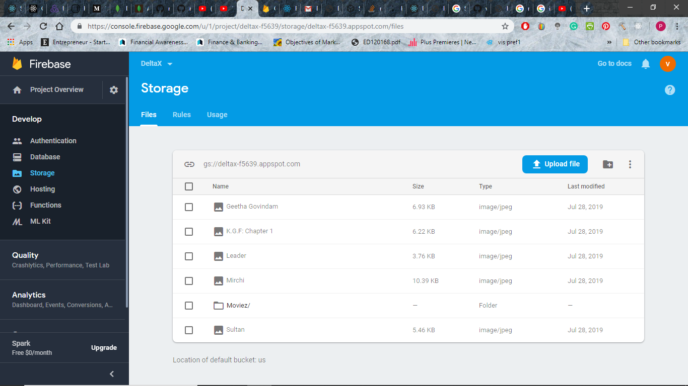
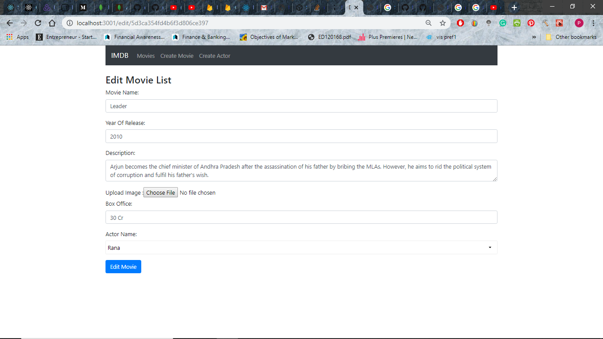

Step 1 : After Downloading the Project from Github, open the Project in a Text editor. open a terminal in the server.js file and run the following command 'node server.js' to start the server at port 5000 and set up the MongoDB connection. 

Step 2 : Run npm start to run the app in development mode and you will be sent to a page that looks like the screenshot below.

Step 3 : Click on Create Actor link to fill in the details of the actor.

Step 4 : Click on the Create Movie link to fill in the details of the Movie. The upload button uploads the selected File to Firebase storage with the name as that of the Movie Name. The Actor Name Field can accept multiple inputs.

The MongoDB Atlas will be Updated whenever the user either adds a Movie or an Actor.

Firebase Storage will be updated when the user uploads a Movie Image.

Step 5 : Click on Edit to edit any details of the movie or Click on Delete to delete the movie from MongoDB.

